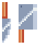
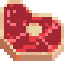
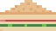

food icons by: PiiiXL
https://piiixl.itch.io/food

# howto run
Just running the executable should work (i hope).

# howto play
use your tools (left side) with the keyboard keys 1-4 to process the ingredients and complete the recipes (bottom left side).

Every recipe only has one of each ingredient. Using the wrong tool will waste the ingredient.

# Recipes

## soup

## burger

## sandwitch

## sushi

## orange

